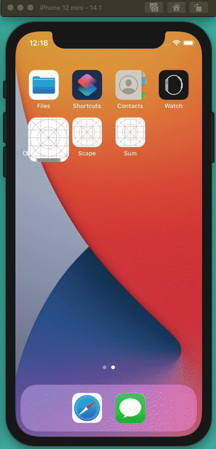

# ObjectView-ImagePOC
Using ObjectView to load a remote image

## Example Code
```swift
import SwiftUI
import SUIObject
import Combino

struct ContentView: View {
    var body: some View {
        Object(UInt32(3)) { obj in
            
            obj.add(variable: "imageURL", value: "https://hips.hearstapps.com/hmg-prod.s3.amazonaws.com/images/dog-puppy-on-garden-royalty-free-image-1586966191.jpg?crop=1.00xw:0.669xh;0,0.190xh&resize=1200:*")
            
            obj.add(function: "loadImage") { _ -> Void in
                guard let imageURL = obj.imageURL.stringValue(),
                      let url = URL(string: imageURL) else {
                    return
                }
                obj.add(variable: "imageFectcherTask", value: Combino.fetch(url: url).sink(.success { (data, response) in
                    Combino.main(withDelay: obj.value() ?? 0) {
                        obj.add(variable: "loadedImage", value: UIImage(data: data!)!)
                        
                        print(obj)
                    }
                }))
            }
            
            obj.run(function: "loadImage")
            
        }
        .view { obj in
            ZStack {
                if let image = obj.loadedImage.value(as: UIImage.self) {
                    Image(uiImage: image)
                        .resizable()
                        .aspectRatio(contentMode: .fit)
                } else {
                    ProgressView()
                }
            }
        }
    }
}
```

## Demo


## Printing the Object
```swift
Object {
|	Variables
|	* imageURL: https://hips.hearstapps.com/hmg-prod.s3.amazonaws.com/images/dog-puppy-on-garden-royalty-free-image-1586966191.jpg?crop=1.00xw:0.669xh;0,0.190xh&resize=1200:* (String)
|	* imageFectcherTask: Combine.AnyCancellable (AnyCancellable)
|	* _value: 3 (UInt32)
|	* loadedImage: <UIImage:0x6000005c4240 anonymous {1200, 602}> (UIImage)
|	Functions
|	* loadImage: (Function)
}
```
